# Font Design GAN

Code for training/generating GAN, that is for font design.

## Samples
Generated fonts, they have various styles and they are readable as a character.
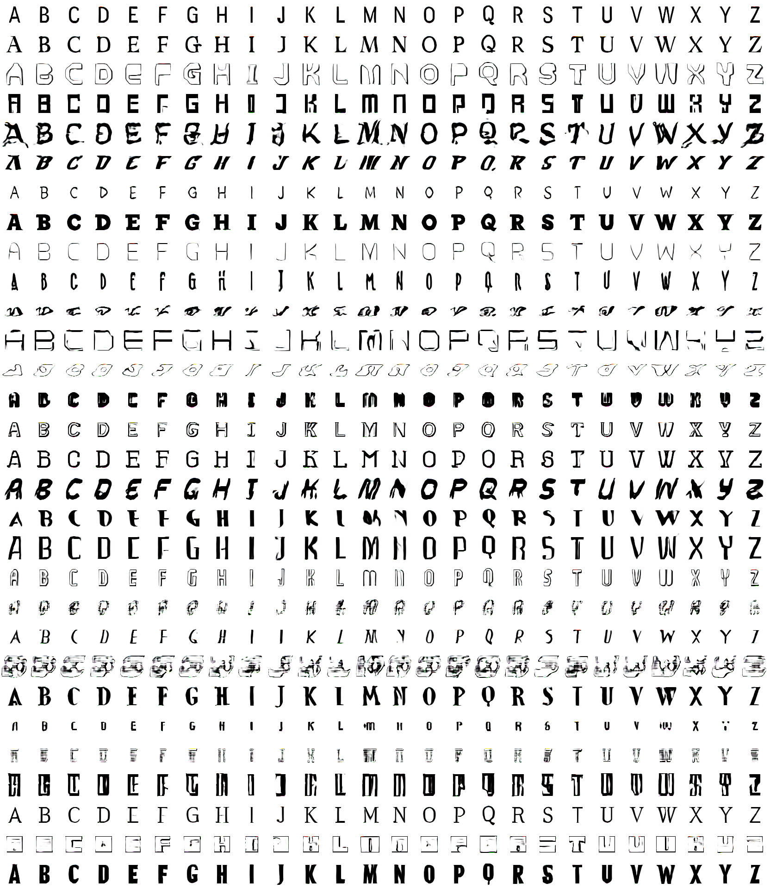

Random walk in style-input space.
You can watch gradually transformed fonts.

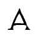
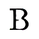
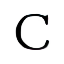
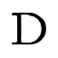
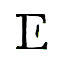
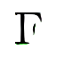
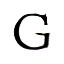
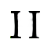
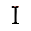
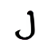
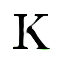
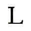

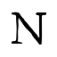
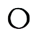
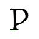
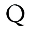
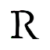
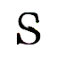
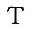
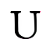
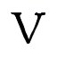
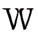
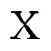
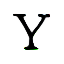
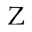

## How to use

### Environment
The auther checked running codes in only following environment:
- Ubuntu 16.04 LTS
- GeForce GTX 1080 & [Driver](http://www.nvidia.com/Download/index.aspx) (Driver Version: 384.111)
- [CUDA 8.0](https://developer.nvidia.com/cuda-80-ga2-download-archive)
- [cuDNN v6.0](https://developer.nvidia.com/cudnn) (Membership required)

If you'd like to run with latest environment, revise some files as necessary.

Firstly clone this repository.
Add `--recursive` because this repository contains submodule ([font2img](https://github.com/uchidalab/font2img))
```
git clone --recursive https://github.com/uchidalab/fontdesign_gan
cd fontdesign_gan
```

#### with Docker (GPU required)

If you use GPU and Docker, it's easy to set up your environment.
Requirement libraries are written in Dockerfile.  
Install GPU Driver/[NVIDIA Docker](https://github.com/NVIDIA/nvidia-docker) and run following commands:
```
docker build -t fontdesign_gan .
docker run --runtime=nvidia -it --rm -p 6006:6006 --volume `pwd`:/workdir -w /workdir/ fontdesign_gan
```

#### no Docker

with GPU:
Install GPU Driver/CUDA/cuDNN and run following command:
```
pip install -r requirements_gpu.txt
```

with CPU:
Run following command:
```
pip install -r requirements_cpu.txt
```

### Prepare

Convert font files (.ttf) into image files (.png), and pack them into a HDF5 file (.h5)

Make a directory (ex. `./ttfs`) and copy font files.
Set destination path (ex. `./src/myfonts.h5`) and run.
```
python main.py --ttf2png --png2h5 --font_ttfs ./ttfs --font_h5 ./src/myfonts.h5
```

`--ttf2png` is the option for converting, image files are saved in `./src/pngs/{YYYY-MM-DD_HHmmss}`.
If you use `--font_pngs` option, you can set path yourself.  
`--png2h5` is the option for packing, packed file is saved in the path you set with `--font_h5` option.

### Train

Set packed file's path and run.

```
python main.py --train --font_h5 ./src/myfonts.h5
```

Results are saved in `./result/{YYYY-MM-DD_HHmmss}`.
You can set destination with `--gan_dir`.

In `log` directory, saved same files: flags' log, latest/kept TensorFlow's dumps (.ckpt\*), TensorBoard's log.  
In `sample` directory, fonts that generated temporary are saved.

While training, TensorBoard is also running.
Access URL that will shown in command line.

### Generate

Set a path of trained GAN's output directory and a JSON file.

The JSON file have to be written style/character IDs.
A style ID correspond with a random matrix.
A character ID correspond with a character.

IDs are loaded in order, and you can use some operands.
For example, if JSON file is following:
```
"style_ids": [
  "0", "4", "21", "10..29:5"
],
"char_ids": [
  "0-3", "6*4"
],
"col_n": 4
```
Input IDs will be like this:
```
style_ids = [0, 4, 21, (between 10 and 29 with 5 steps)]
char_ids = [0, 1, 2, 3, 6, 6, 6, 6]
```
and, # of result columns is 4. Also check sample files (`./jsons/sample*.json`).

After preparing JSON file, run like this:
```
python main.py --generate --gan_dir ./result/{trained} --ids ./jsons/sample01.json
```
Generated fonts are saved in `./result/{trained}/generated/{YYYY-MM-DD_HHmmss}.png`.
You can set output file name with `--gen_name`.

If you want random walking fonts, use `--generate_walk`. A JSON file is needless.
```
python main.py --generate_walk --gan_dir ./result/{YYYY-MM-DD_HHmmss} --char_img_n 256
```
256 styles' fonts will be generated, and they are transformed gradually.

### Options

There are many options. Check following table.

|For|Option|Description|Default|
|:-|:-|:-|:-|
|Prepare, Train|`--img_width`|width of images|64|
|Prepare, Train|`--img_height`|height of images|64|
|Prepare, Train|`--img_dim`|dimension of images|3|
|Prepare, Train|`--chars_type`|you can choose characters type, "caps" or "hiragana"|"caps"|
|Train, Generate|`--gpu_ids`|GPU IDs you use. This type is string (ex. "0, 1").|(set automatically)|
|Train, Generate|`--batch_size`|batch size for GAN|256|
|Train|`--arch`|architect of GAN models. choose "DCGAN" or "ResNet"|"DCGAN"|
|Train|`--style_ids_n`|# of style IDs|256|
|Train|`--style_z_size`|size of style_z|100|
|Train|`--gan_epoch_n`|# of epoch iterations|10000|
|Train|`--critic_n`|# of critic iterations|5|
|Train|`--sample_imgs_interval`|interval of saving sample images|10|
|Train|`--sample_col_n`|# of sample image's columns|26|
|Train|`--keep_ckpt_interval`|interval of keeping TensorFlow's dumps|250|
|Train|`--run_tensorboard`|run tensorboard or not|True|
|Train|`--tensorboard_port`|port for tensorboard page|6006|
